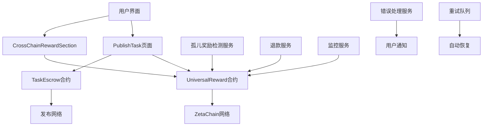
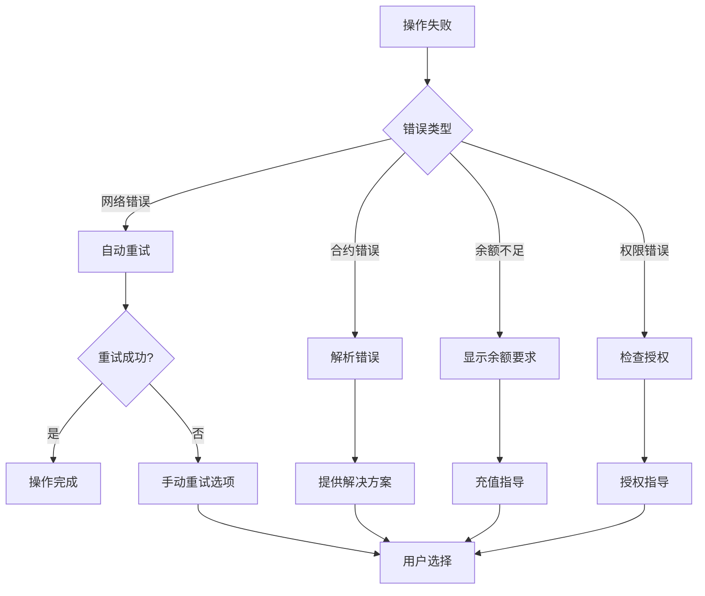

# 孤儿奖励修复设计文档

## 概述

本设计文档详细说明了如何修复跨链奖励与任务关联失败导致的孤儿奖励问题。解决方案专注于前端流程改进，不修改现有智能合约，通过利用现有合约功能来实现完整的修复。

## 架构

### 系统架构图



### 核心组件关系

1. **前端组件层**
   - CrossChainRewardSection: 跨链奖励创建
   - PublishTask: 任务发布和奖励关联
   - CrossChainRewardDisplay: 奖励状态显示

2. **服务层**
   - OrphanRewardDetectionService: 孤儿奖励检测
   - RefundService: 批量退款处理
   - TaskRewardAssociationService: 任务奖励关联

3. **合约层**
   - UniversalReward: 跨链奖励管理
   - TaskEscrow: 任务生命周期管理

## 组件和接口

### 1. 孤儿奖励检测服务 (OrphanRewardDetectionService)

```typescript
interface OrphanRewardDetectionService {
  // 检测所有孤儿奖励
  detectOrphanRewards(): Promise<OrphanReward[]>;
  
  // 检测特定创建者的孤儿奖励
  detectOrphanRewardsByCreator(creator: string): Promise<OrphanReward[]>;
  
  // 实时监控新的孤儿奖励
  startMonitoring(): void;
  
  // 停止监控
  stopMonitoring(): void;
}

interface OrphanReward {
  rewardId: string;
  creator: string;
  amount: string;
  asset: string;
  targetChainId: string;
  createdAt: number;
  status: RewardStatus;
}
```

### 2. 批量退款服务 (RefundService)

```typescript
interface RefundService {
  // 批量退款孤儿奖励
  batchRefund(rewardIds: string[]): Promise<RefundResult[]>;
  
  // 单个奖励退款
  refundSingle(rewardId: string): Promise<RefundResult>;
  
  // 验证退款资格
  validateRefundEligibility(rewardId: string): Promise<boolean>;
}

interface RefundResult {
  rewardId: string;
  success: boolean;
  txHash?: string;
  error?: string;
  gasUsed?: string;
}
```

### 3. 任务奖励关联服务 (TaskRewardAssociationService)

```typescript
interface TaskRewardAssociationService {
  // 关联奖励到任务
  associateRewardToTask(rewardId: string, taskId: string): Promise<AssociationResult>;
  
  // 验证关联状态
  verifyAssociation(rewardId: string, taskId: string): Promise<boolean>;
  
  // 自动关联失败时的回滚
  rollbackOnFailure(rewardId: string): Promise<void>;
}

interface AssociationResult {
  success: boolean;
  txHash?: string;
  error?: string;
  rollbackExecuted?: boolean;
}
```

## 数据模型

### 孤儿奖励数据模型

```typescript
interface OrphanRewardRecord {
  rewardId: string;
  creator: string;
  asset: string;
  amount: bigint;
  targetChainId: string;
  status: RewardStatus;
  createdAt: number;
  lastChecked: number;
  refundAttempts: number;
  errorHistory: string[];
}

enum RewardStatus {
  Prepared = 0,
  Deposited = 1,    // 孤儿奖励通常处于此状态
  Locked = 2,
  Claimed = 3,
  Refunded = 4,     // 目标状态
  Reverted = 5
}
```

### 关联状态数据模型

```typescript
interface AssociationState {
  rewardId: string;
  taskId: string;
  status: 'pending' | 'success' | 'failed' | 'rolled_back';
  attempts: number;
  lastAttempt: number;
  error?: string;
}
```

## 正确性属性

*属性是一个特征或行为，应该在系统的所有有效执行中保持为真——本质上是关于系统应该做什么的正式声明。属性作为人类可读规范和机器可验证正确性保证之间的桥梁。*

### 属性 1: 孤儿奖励检测完整性
*对于任何* UniversalReward合约状态，检测服务应该能够识别所有taskId为0且状态为Deposited的奖励记录
**验证: 需求 1.1**

### 属性 2: 批量退款原子性
*对于任何* 孤儿奖励列表，批量退款操作应该确保所有符合条件的奖励都被处理，失败的奖励不影响成功的奖励
**验证: 需求 1.2**

### 属性 3: 退款状态一致性
*对于任何* 成功执行的退款操作，奖励状态应该从Deposited变更为Refunded，且资金应该返回给创建者
**验证: 需求 1.3**

### 属性 4: 任务奖励关联原子性
*对于任何* 跨链奖励创建和任务创建的组合操作，要么两者都成功且正确关联，要么奖励被自动退款
**验证: 需求 2.1, 2.3**

### 属性 5: 关联验证一致性
*对于任何* 成功关联的奖励和任务，getRewardByTask(taskId)应该返回正确的rewardId，且奖励状态应该为Locked
**验证: 需求 2.2, 2.4**

### 属性 6: 错误处理完整性
*对于任何* 跨链奖励操作失败，系统应该提供具体的错误信息和相应的恢复建议
**验证: 需求 3.1**

### 属性 7: 自动退款触发
*对于任何* lockForTask调用失败的情况，系统应该自动调用refund函数并更新用户界面状态
**验证: 需求 3.2**

### 属性 8: 前置条件验证
*对于任何* 跨链奖励创建请求，系统应该验证用户余额、网络状态和合约可用性等前置条件
**验证: 需求 4.2**

### 属性 9: 异常状态日志记录
*对于任何* 检测到的异常状态，系统应该记录包含时间戳、错误类型、相关参数的详细日志
**验证: 需求 4.3**

### 属性 10: 监控告警触发
*对于任何* 新检测到的孤儿奖励，监控系统应该在配置的时间窗口内发送告警通知
**验证: 需求 5.1**

## 错误处理

### 错误分类和处理策略

1. **网络错误**
   - 自动重试机制（最多3次）
   - 指导用户检查网络连接
   - 提供手动重试选项

2. **合约调用错误**
   - 解析具体错误原因
   - 提供针对性解决方案
   - 自动回滚机制

3. **余额不足错误**
   - 明确显示所需金额
   - 提供充值指导
   - 暂停操作直到余额充足

4. **权限错误**
   - 验证用户身份
   - 检查合约授权状态
   - 提供授权指导

### 错误恢复流程



## 测试策略

### 单元测试

单元测试将验证各个组件的具体功能：

- **OrphanRewardDetectionService**: 测试孤儿奖励检测逻辑
- **RefundService**: 测试单个和批量退款功能
- **TaskRewardAssociationService**: 测试任务奖励关联逻辑
- **错误处理组件**: 测试各种错误场景的处理

### 属性测试

属性测试将使用**fast-check**库验证系统的通用正确性属性，每个测试运行**100次迭代**：

- **属性 1**: 孤儿奖励检测完整性测试
  - 生成随机的合约状态，验证检测服务能识别所有孤儿奖励
  - **特性: orphan-reward-fix, 属性 1: 孤儿奖励检测完整性**

- **属性 2**: 批量退款原子性测试
  - 生成随机的孤儿奖励列表，验证批量操作的原子性
  - **特性: orphan-reward-fix, 属性 2: 批量退款原子性**

- **属性 3**: 退款状态一致性测试
  - 生成随机的退款操作，验证状态变更的一致性
  - **特性: orphan-reward-fix, 属性 3: 退款状态一致性**

- **属性 4**: 任务奖励关联原子性测试
  - 生成随机的奖励和任务组合，验证关联操作的原子性
  - **特性: orphan-reward-fix, 属性 4: 任务奖励关联原子性**

- **属性 5**: 关联验证一致性测试
  - 生成随机的关联操作，验证验证逻辑的一致性
  - **特性: orphan-reward-fix, 属性 5: 关联验证一致性**

### 集成测试

集成测试将验证组件间的协作：

- **端到端跨链奖励流程**: 从创建到关联的完整流程
- **错误恢复流程**: 各种失败场景下的恢复机制
- **监控和告警系统**: 实时监控和通知功能

### 测试配置

- **属性测试库**: fast-check
- **最小迭代次数**: 100次
- **测试环境**: 本地测试网络和ZetaChain Athens测试网
- **覆盖率要求**: 核心逻辑90%以上

## 实施计划

### 第一阶段: 立即清理（1-2天）

1. **创建孤儿奖励检测脚本**
   - 扫描所有现有奖励记录
   - 识别taskId=0的记录
   - 生成详细报告

2. **实施批量退款功能**
   - 为每个创建者分组处理
   - 实施安全检查和确认机制
   - 记录所有操作日志

3. **验证清理结果**
   - 确认所有孤儿奖励状态更新
   - 验证资金正确返还
   - 通知受影响用户

### 第二阶段: 流程修复（2-3天）

1. **修改useCreateTask Hook**
   - 在createTaskAtomic函数中添加lockForTask调用
   - 实施失败回滚机制
   - 添加详细错误处理

2. **改进CrossChainRewardSection**
   - 增强状态管理
   - 改进用户反馈
   - 添加操作确认机制

3. **更新CrossChainRewardDisplay**
   - 改进错误状态显示
   - 添加重试功能
   - 优化用户体验

### 第三阶段: 预防和监控（2-3天）

1. **实施监控服务**
   - 实时检测新的孤儿奖励
   - 配置告警阈值
   - 建立通知机制

2. **添加预防机制**
   - 前置条件验证
   - 操作状态跟踪
   - 自动恢复功能

3. **完善错误处理**
   - 分类错误类型
   - 提供解决方案
   - 改进用户指导

### 第四阶段: 测试和验证（1-2天）

1. **编写测试套件**
   - 单元测试
   - 属性测试
   - 集成测试

2. **执行全面测试**
   - 功能测试
   - 性能测试
   - 用户体验测试

3. **部署和监控**
   - 部署到测试环境
   - 监控系统运行状态
   - 收集用户反馈

## 风险评估和缓解

### 技术风险

1. **Gas费用风险**
   - 缓解: 批量操作优化，Gas价格监控
   - 预估: 每次退款约0.001 ETH

2. **网络拥堵风险**
   - 缓解: 重试机制，多RPC端点
   - 监控: 交易确认时间

3. **合约限制风险**
   - 缓解: 充分测试，边界条件验证
   - 备选: 紧急暂停机制

### 业务风险

1. **用户信任风险**
   - 缓解: 透明沟通，详细说明
   - 措施: 用户通知，操作日志

2. **资金安全风险**
   - 缓解: 多重验证，操作审计
   - 保障: 只退还给原创建者

3. **服务中断风险**
   - 缓解: 渐进式部署，快速回滚
   - 监控: 实时状态检查

## 性能考虑

### 批量操作优化

- **分批处理**: 每批最多10个奖励
- **并发控制**: 最多3个并发交易
- **Gas优化**: 动态调整Gas价格

### 监控性能

- **检测频率**: 每5分钟检查一次
- **缓存策略**: 缓存检测结果1分钟
- **资源限制**: 单次检测最多处理100个奖励

### 用户体验优化

- **响应时间**: 操作反馈<2秒
- **进度显示**: 实时更新操作状态
- **错误恢复**: 自动重试+手动选项

## 总结

本设计通过前端流程改进解决孤儿奖励问题，不需要修改现有合约。核心策略包括：

1. **立即清理**: 退还现有21个孤儿奖励
2. **流程修复**: 确保lockForTask正确调用
3. **预防机制**: 监控和自动恢复
4. **用户体验**: 改进错误处理和反馈

解决方案具有低风险、高效率的特点，能够快速解决当前问题并防止未来再次发生。