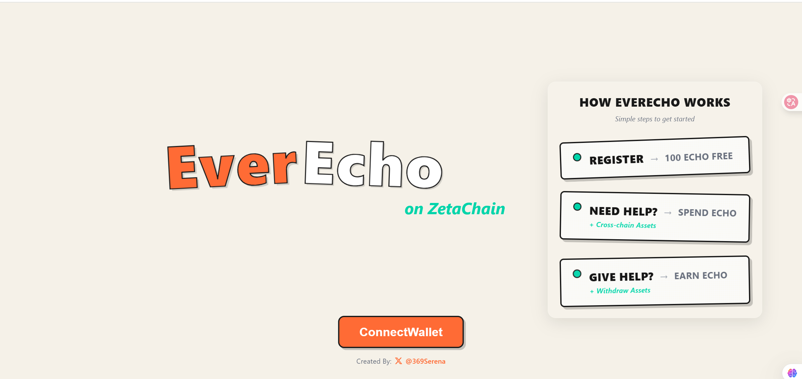
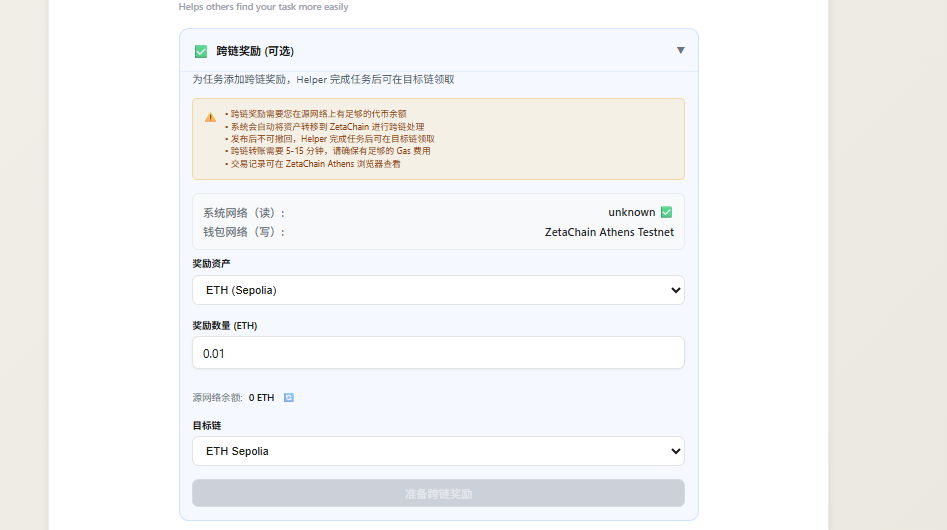
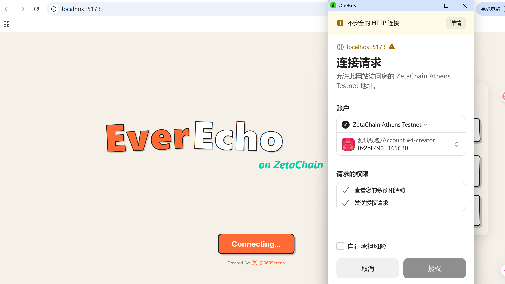
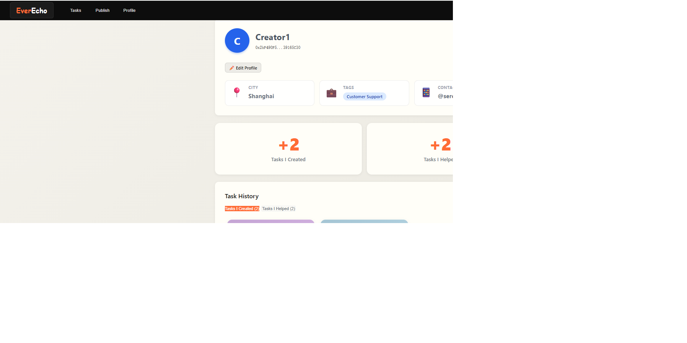
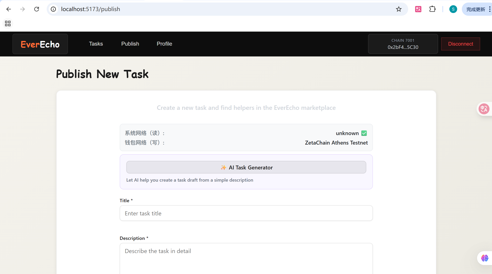

# EverEcho on ZetaChain | 基于 ZetaChain 的互助网络

<div align="center">



**🌉 Make help echo across chains. Turn social capital into verifiable, cross-chain value.**

**让帮助跨链回响，将社会资本转化为可验证的跨链价值**

[](https://ever-echo-2025.vercel.app/)
[](https://www.zetachain.com/)
[](LICENSE)

**🔗 Live Demo | 在线体验**: [https://ever-echo-2025.vercel.app/](https://ever-echo-2025.vercel.app/)

</div>

---

## 🌟 What is EverEcho? | 什么是 EverEcho？

**English**: EverEcho is a **cross-chain mutual aid ecosystem** built on ZetaChain that enables users to earn **ECHO tokens** by helping others and spend them across multiple blockchains. Each act of help becomes a **trusted, on-chain record** with **cross-chain reward capabilities**.

**中文**: EverEcho 是构建在 ZetaChain 上的**跨链互助生态系统**，用户可以通过帮助他人赚取 **ECHO 代币**，并在多个区块链上使用这些代币。每一次帮助都会成为**可信的链上记录**，并具备**跨链奖励功能**。

---

## ✨ Why EverEcho on ZetaChain? | 为什么选择 ZetaChain 上的 EverEcho？

### Traditional Problems | 传统问题
**English**: Traditional Web2 mutual aid platforms suffer from:
- **Fragmented value**: contributions scattered across platforms
- **Closed ecosystems**: value locked within single platforms  
- **Limited reach**: no cross-chain interoperability
- **Trust barriers**: high friction for stranger collaboration

**中文**: 传统的 Web2 互助平台存在以下问题：
- **价值碎片化**：贡献分散在各个平台
- **封闭生态**：价值被锁定在单一平台内
- **覆盖有限**：缺乏跨链互操作性
- **信任壁垒**：陌生人协作摩擦成本高

### Our Solution | 我们的解决方案
**English**: EverEcho leverages **ZetaChain's omnichain capabilities** to create:
- **Universal value**: ECHO tokens work across all connected chains
- **Cross-chain rewards**: offer incentives in any supported asset
- **Seamless UX**: one interface, multiple blockchain benefits
- **Verifiable trust**: on-chain reputation that travels with you

**中文**: EverEcho 利用 **ZetaChain 的全链能力**创造：
- **通用价值**：ECHO 代币在所有连接的链上都能使用
- **跨链奖励**：可以用任何支持的资产提供激励
- **无缝体验**：一个界面，多个区块链的好处
- **可验证信任**：跟随用户的链上声誉

---

## 🚀 Key Features | 核心功能

### 🌉 Cross-Chain Rewards | 跨链奖励 (Powered by ZetaChain)



**English**:
- **Multi-asset incentives**: Offer rewards in USDC, ETH, or any ZRC20 token
- **Cross-chain claiming**: Helpers receive rewards on their preferred chain
- **Universal liquidity**: Access to assets across the entire omnichain ecosystem
- **Seamless bridging**: Automatic cross-chain transfers via ZetaChain

**中文**:
- **多资产激励**：可用 USDC、ETH 或任何 ZRC20 代币提供奖励
- **跨链领取**：帮助者可在首选链上接收奖励
- **通用流动性**：访问整个全链生态系统的资产
- **无缝桥接**：通过 ZetaChain 自动跨链转账

### 💰 ECHO Token Economy | ECHO 代币经济

<div align="center">

**English**:
```
Token Flow Cycle:
┌─────────────┐    Help Others    ┌─────────────┐
│   Register  │ ──────────────► │  Earn ECHO  │
│  +100 ECHO  │                 │ + Cross-chain│
└─────────────┘                 └─────────────┘
       ▲                               │
       │                               │
       │                               ▼
┌─────────────┐   Need Help      ┌─────────────┐
│ Fee Burned  │ ◄──────────────  │ Spend ECHO  │
│   (-2%)     │                 │ + Rewards   │
└─────────────┘                 └─────────────┘
```

**中文**:
```
代币流转循环：
┌─────────────┐    帮助他人      ┌─────────────┐
│    注册     │ ──────────────► │  赚取ECHO   │
│  +100 ECHO  │                 │ + 跨链奖励  │
└─────────────┘                 └─────────────┘
       ▲                               │
       │                               │
       │                               ▼
┌─────────────┐    需要帮助      ┌─────────────┐
│  费用销毁   │ ◄──────────────  │ 消费ECHO    │
│   (-2%)     │                 │ + 奖励      │
└─────────────┘                 └─────────────┘
```

</div>

**English**:
- **Initial mint**: 100 ECHO tokens for new users
- **Earn by helping**: Complete tasks to earn ECHO + cross-chain rewards
- **Spend to get help**: Use ECHO to incentivize others
- **Deflationary mechanism**: 2% platform fee burned on completion

**中文**:
- **初始铸造**：新用户获得 100 ECHO 代币
- **帮助赚取**：完成任务赚取 ECHO + 跨链奖励
- **消费求助**：使用 ECHO 激励他人
- **通缩机制**：完成时销毁 2% 平台费用

### 🔒 Privacy-First Design | 隐私优先设计

**English**:
- **Encrypted contacts**: AES-256-GCM encryption for user privacy
- **Off-chain metadata**: Sensitive data stored securely off-chain
- **On-chain verification**: Only essential data on blockchain

**中文**:
- **加密联系方式**：使用 AES-256-GCM 加密保护用户隐私
- **链下元数据**：敏感数据安全存储在链下
- **链上验证**：只有必要数据上链

### 🎯 Smart Task Management | 智能任务管理

**English**:
- **State machine**: `Open → InProgress → Submitted → Completed`
- **Bilateral staking**: Both parties commit to ensure completion
- **Timeout protection**: Automatic resolution for stalled tasks
- **Dispute resolution**: Built-in moderation mechanisms

**中文**:
- **状态机**：`开放 → 进行中 → 已提交 → 已完成`
- **双向质押**：双方承诺确保完成
- **超时保护**：停滞任务自动解决
- **争议解决**：内置调解机制

---

## 🏗️ Technical Architecture | 技术架构

### System Overview | 系统概览

<div align="center">

```
┌─────────────────┐    ┌─────────────────┐    ┌─────────────────┐
│   Frontend      │    │   Backend       │    │   ZetaChain     │
│   React DApp    │◄──►│   Node.js API   │◄──►│   Smart         │
│     前端        │    │     后端        │    │   Contracts     │
│                 │    │                 │    │   智能合约      │
└─────────────────┘    └─────────────────┘    └─────────────────┘
         │                       │                       │
         │                       │                       │
         ▼                       ▼                       ▼
┌─────────────────┐    ┌─────────────────┐    ┌─────────────────┐
│   Web3 Wallet   │    │   PostgreSQL    │    │   IPFS/Storage  │
│   MetaMask      │    │   Database      │    │   Metadata      │
│   Web3 钱包     │    │   数据库        │    │   元数据存储    │
└─────────────────┘    └─────────────────┘    └─────────────────┘
```

</div>

### Smart Contracts | 智能合约 (ZetaChain Athens Testnet)

```
📦 Core Contracts | 核心合约
├── 🪙 EOCHO Token (ERC20)
│   ├── Initial mint: 100 ECHO per user | 初始铸造：每用户 100 ECHO
│   ├── Supply cap: 10,000,000 ECHO | 供应上限：10,000,000 ECHO
│   └── Fee burn mechanism | 费用销毁机制
├── 📝 Register Contract | 注册合约
│   ├── User registration & profiles | 用户注册和档案
│   └── Initial ECHO minting | 初始 ECHO 铸造
├── 🔄 TaskEscrow Contract | 任务托管合约
│   ├── Task state machine | 任务状态机
│   ├── Bilateral staking | 双向质押
│   └── Automatic settlement | 自动结算
└── 🌉 EverEchoGateway (Cross-chain) | EverEcho 网关（跨链）
    ├── ZRC20 reward deposits | ZRC20 奖励存款
    ├── Cross-chain claiming | 跨链领取
    └── Multi-asset support | 多资产支持
```

### Cross-Chain Flow | 跨链流程

<div align="center">

```
Source Chain          ZetaChain           Target Chain
源链                  ZetaChain            目标链
     │                     │                   │
     │ 1. Deposit Asset     │                   │
     │    存入资产          │                   │
     ├────────────────────►│                   │
     │                     │ 2. Lock & Record  │
     │                     │    锁定并记录     │
     │                     ├──────────────────►│
     │                     │                   │ 3. Task Complete
     │                     │                   │    任务完成
     │                     │ 4. Claim Request  │
     │                     │    领取请求       │
     │                     │◄──────────────────┤
     │                     │                   │
     │ 5. Release Asset     │ 6. Cross-chain   │
     │    释放资产          │    Transfer       │
     │◄────────────────────┤    跨链转账       │
     │                     ├──────────────────►│ 7. Receive Reward
     │                     │                   │    接收奖励
```

</div>

### Technology Stack | 技术栈

**English**:
- **Blockchain**: ZetaChain (Omnichain Smart Contracts)
- **Frontend**: React + TypeScript + Tailwind CSS
- **Web3**: Ethers.js + Wagmi + Viem
- **Backend**: Node.js + Express + PostgreSQL
- **Encryption**: AES-256-GCM for contact privacy
- **Cross-chain**: ZetaChain Protocol Contracts

**中文**:
- **区块链**：ZetaChain（全链智能合约）
- **前端**：React + TypeScript + Tailwind CSS
- **Web3**：Ethers.js + Wagmi + Viem
- **后端**：Node.js + Express + PostgreSQL
- **加密**：AES-256-GCM 联系方式隐私保护
- **跨链**：ZetaChain 协议合约

---

## 📱 User Journey | 用户流程

### 1. 🔗 Connect Wallet | 连接钱包


**English**: Connect with MetaMask, WalletConnect, or any compatible wallet.

**中文**: 支持 MetaMask、WalletConnect 或任何兼容钱包。

### 2. 📝 Register & Profile | 注册和档案


**English**: Get 100 ECHO tokens + create your profile to start helping others.

**中文**: 获得 100 ECHO 代币 + 创建档案开始帮助他人。

### 3. 🎯 Create/Find Tasks | 创建/寻找任务


**English**: Post help requests or browse available tasks in the community.

**中文**: 发布求助请求或浏览社区中的可用任务。

### 4. 💰 Add Cross-chain Rewards | 添加跨链奖励

**English**: Optional ZRC20 incentives to attract the best helpers.

**中文**: 可选的 ZRC20 激励来吸引最优秀的帮助者。

### 5. 🤝 Complete Tasks | 完成任务

**English**: Collaborate off-chain, verify on-chain with smart contract protection.

**中文**: 链下协作，通过智能合约保护进行链上验证。

### 6. 🎁 Claim Rewards | 领取奖励

**English**: Receive ECHO + cross-chain assets directly to your preferred chain.

**中文**: 直接在您首选的链上接收 ECHO + 跨链资产。

---

## 🛠️ Development Setup | 开发设置

### Prerequisites | 前置要求
- Node.js 18+
- npm or yarn | npm 或 yarn
- MetaMask or compatible wallet | MetaMask 或兼容钱包

### Quick Start | 快速开始

```bash
# Clone repository | 克隆仓库
git clone https://github.com/Serenayyy123/EverEcho-on-ZetaChain.git
cd EverEcho-on-ZetaChain

# Install dependencies | 安装依赖
npm install

# Setup environment | 设置环境
cp .env.example .env.local
# Configure your environment variables | 配置环境变量

# Start development servers | 启动开发服务器
npm run dev:frontend  # Frontend on http://localhost:5173 | 前端
npm run dev:backend   # Backend on http://localhost:3001 | 后端

# Deploy contracts (ZetaChain Athens Testnet) | 部署合约
npm run deploy:zeta
```

### Environment Variables | 环境变量
```bash
# .env.local
VITE_ZETACHAIN_RPC_URL=https://zetachain-athens-evm.blockpi.network/v1/rpc/public
VITE_EOCHO_TOKEN_ADDRESS=0x...
VITE_REGISTER_ADDRESS=0x...
VITE_TASK_ESCROW_ADDRESS=0x...
VITE_EVERECHO_GATEWAY_ADDRESS=0x...
DEPLOYER_PRIVATE_KEY=your_private_key
```

---

## 🌐 Deployed Contracts | 已部署合约 (ZetaChain Athens Testnet)

| Contract 合约 | Address 地址 | Purpose 用途 |
|---------------|--------------|--------------|
| EOCHO Token | `0xE0e8CD2F3a8bd6241B09798DEe98f1c777537b4D` | ERC20 utility token \| ERC20 实用代币 |
| Register | `0x2fD2B2F4D965ffEF9B66dfBc78285AB76b290eaA` | User registration \| 用户注册 |
| TaskEscrow | `0xE442Eb737983986153E42C9ad28530676d8C1f55` | Task management \| 任务管理 |
| EverEchoGateway | `0x56C0E5531981394E473016F43E550F17fDE9b6C3` | Cross-chain rewards \| 跨链奖励 |

---

## 🤝 Contributing | 贡献

**English**: We welcome contributions! Please see our [Contributing Guide](CONTRIBUTING.md) for details.

**中文**: 我们欢迎贡献！请查看我们的[贡献指南](CONTRIBUTING.md)了解详情。

1. Fork the repository | 分叉仓库
2. Create your feature branch | 创建功能分支 (`git checkout -b feature/amazing-feature`)
3. Commit your changes | 提交更改 (`git commit -m 'Add amazing feature'`)
4. Push to the branch | 推送到分支 (`git push origin feature/amazing-feature`)
5. Open a Pull Request | 开启拉取请求

---

## 📞 Contact Us | 联系我们

- **Twitter**: [@369Serena](https://x.com/369Serena)
- **Website**: [https://ever-echo-2025.vercel.app/](https://ever-echo-2025.vercel.app/)
- **GitHub**: [EverEcho-on-ZetaChain](https://github.com/Serenayyy123/EverEcho-on-ZetaChain)

---

## 📄 License | 许可证

**English**: This project is licensed under the MIT License - see the [LICENSE](LICENSE) file for details.

**中文**: 本项目采用 MIT 许可证 - 详见 [LICENSE](LICENSE) 文件。

---

<div align="center">

**🌉 Built with ❤️ on ZetaChain | 基于 ZetaChain 用 ❤️ 构建**

*Reach out, the world echoes back across chains*

*伸出援手，世界跨链回响*

</div>